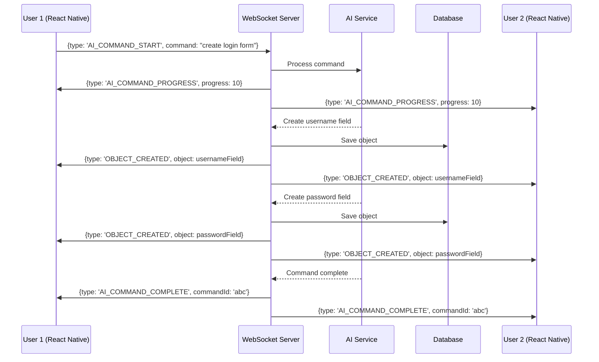

# WebSocket-First Architecture Rationale

## Overview

CollabCanvas uses a **WebSocket-first architecture** where all real-time operations (shape manipulation, AI commands, presence tracking) flow through WebSocket connections instead of traditional HTTP REST APIs.

---

## Architecture Decision

### Primary Data Path: WebSocket
All operations that require real-time synchronization across multiple users are performed via WebSocket:

✅ **Shape Operations** (create, update, delete)  
✅ **AI Commands** (process, progress, complete, error, cancel)  
✅ **Cursor & Presence** (position updates, user join/leave)  
✅ **Canvas Sync** (state requests, full state, deltas)  

### Secondary Data Path: HTTP REST
HTTP endpoints are reserved for:

✅ **Authentication** (login, register, token refresh)  
✅ **Canvas Metadata** (list, create, update settings)  
✅ **Read-Only Access** (get shapes, AI history, suggestions)  
✅ **Collaboration Setup** (invite users, manage permissions)  

---

## Rationale

### 1. **Real-time Synchronization**

**Problem:** Traditional HTTP request/response cycles introduce latency and require polling or complex state reconciliation.

**Solution:** WebSocket maintains persistent bidirectional connections, enabling instant synchronization:
- User A creates a shape → All users see it immediately (<100ms)
- User B runs AI command → All users see results in real-time
- No polling, no stale data, no race conditions

### 2. **AI Operations Across All Users**

**Why WebSocket for AI?**

When a user executes an AI command like "Create a 3x3 grid of squares", the results must be:
1. **Immediately visible** to all collaborators
2. **Synchronized** without conflicts
3. **Progressively updated** as the AI generates shapes
4. **Cancellable** in real-time by the requesting user

**HTTP Limitations:**
```typescript
// ❌ HTTP Approach - Each user must poll for updates
User A: POST /api/gauntlet/ai/process {command: "create grid"}
User B: GET /api/gauntlet/canvas/123/shapes (polling every 1s)
User C: GET /api/gauntlet/canvas/123/shapes (polling every 1s)
// Result: Delayed updates, unnecessary network traffic, state conflicts
```

**WebSocket Solution:**
```typescript
// ✅ WebSocket Approach - Instant broadcast to all users
User A: WS → {type: 'AI_COMMAND_START', command: "create grid"}
Server: Process AI command
Server: WS → ALL {type: 'AI_COMMAND_PROGRESS', progress: 30}
Server: WS → ALL {type: 'OBJECT_CREATED', object: square1}
Server: WS → ALL {type: 'OBJECT_CREATED', object: square2}
// ... continues
Server: WS → ALL {type: 'AI_COMMAND_COMPLETE'}
// Result: Real-time updates, no polling, everyone in sync
```

### 3. **Performance Optimization**

**Latency Targets:**
- Shape operations: <100ms
- Cursor updates: <50ms
- AI commands: <2s (with progressive updates)

**WebSocket Advantages:**
- **No connection overhead:** Reuse existing connection
- **Message batching:** Combine multiple updates (60fps = 16ms intervals)
- **Binary protocol:** Efficient for large datasets
- **Prioritization:** AI commands > shape updates > cursor moves
- **Delta updates:** Send only what changed

**HTTP Limitations:**
- Each request requires new connection (or connection pool management)
- Request/response overhead (headers, parsing, serialization)
- Difficult to batch operations across different users
- Polling wastes bandwidth and increases latency

### 4. **Operational Transformation & Conflict Resolution**

**Challenge:** Multiple users editing simultaneously

**WebSocket Benefits:**
- Server maintains single source of truth
- Operations are serialized through the WebSocket server
- Conflicts resolved in real-time
- Optimistic UI updates with server confirmation

**Example Flow:**
```typescript
// User A and User B both try to move the same object
User A: WS → {type: 'OBJECT_UPDATED', objectId: '123', x: 100}
User B: WS → {type: 'OBJECT_UPDATED', objectId: '123', x: 200}

Server receives A first:
1. Apply A's change (x = 100)
2. Broadcast to all users including B
3. Receive B's change (operating on stale state)
4. Resolve conflict (last write wins or merge)
5. Broadcast final state

// Everyone ends up with the same state
```

### 5. **User Experience**

**Real-time Collaboration UX:**
- See others' cursors moving in real-time
- Watch AI generate designs as you chat
- Instant feedback on actions
- Presence awareness (who's active, what they're doing)
- Collaborative AI (see AI thinking and generating)

**HTTP Limitations:**
- Delayed updates create confusion
- Users unaware of others' actions until they refresh
- AI results appear suddenly without context
- Poor multiplayer experience

---

## Technical Implementation

### WebSocket Message Flow



### Redux Integration

```typescript
// Redux Middleware intercepts AI actions and routes to WebSocket
const websocketMiddleware = (store) => (next) => (action) => {
  switch (action.type) {
    case 'ai/sendCommand':
      // Send via WebSocket, not HTTP
      websocketService.send({
        type: 'AI_COMMAND_START',
        canvasId: action.payload.canvasId,
        command: action.payload.command,
      });
      break;
    
    case 'canvas/createShape':
      // Send via WebSocket, not HTTP
      websocketService.send({
        type: 'OBJECT_CREATED',
        canvasId: action.payload.canvasId,
        object: action.payload.shape,
      });
      break;
  }
  
  return next(action);
};
```

### WebSocket Service

```typescript
class WebSocketService {
  private ws: WebSocket;
  private messageQueue: Message[] = [];
  private flushInterval: NodeJS.Timeout;
  
  constructor() {
    // Batch messages for performance
    this.flushInterval = setInterval(() => this.flush(), 16); // 60fps
  }
  
  send(message: WSMessage) {
    // Prioritize messages
    if (message.type.startsWith('AI_COMMAND')) {
      // High priority - send immediately
      this.ws.send(JSON.stringify(message));
    } else if (message.type.startsWith('OBJECT')) {
      // Medium priority - batch
      this.messageQueue.push(message);
    } else if (message.type === 'CURSOR_MOVE') {
      // Low priority - throttle and batch
      this.throttledCursorUpdate(message);
    }
  }
  
  private flush() {
    if (this.messageQueue.length > 0) {
      this.ws.send(JSON.stringify({
        type: 'BATCH',
        messages: this.messageQueue,
      }));
      this.messageQueue = [];
    }
  }
}
```

---

## Benefits Summary

| Aspect | HTTP REST | WebSocket |
|--------|-----------|-----------|
| **Latency** | 100-500ms | <100ms |
| **AI Sync** | Polling required | Instant broadcast |
| **Bandwidth** | High (repeated requests) | Low (persistent connection) |
| **Scalability** | Connection overhead | Efficient connection reuse |
| **UX** | Delayed updates | Real-time collaboration |
| **Complexity** | Simpler for CRUD | Better for real-time |
| **Caching** | Easy with HTTP | State managed by server |

---

## Trade-offs & Considerations

### WebSocket Challenges

1. **Connection Management**
   - Need to handle disconnects and reconnects
   - State recovery on reconnection
   - **Solution:** Automatic reconnection with state sync

2. **Debugging**
   - Harder to debug than HTTP requests
   - **Solution:** WebSocket message logging, Chrome DevTools

3. **Scaling**
   - Each connection consumes server resources
   - **Solution:** Load balancing, connection limits per canvas

4. **Caching**
   - Can't use HTTP caching
   - **Solution:** In-memory state, periodic snapshots

### HTTP Still Used For

- **Authentication:** JWT token management
- **Canvas Metadata:** Create, list, fork canvases
- **Initial Load:** Fetch canvas state on connection
- **Read-Only Access:** Historical data, AI suggestions
- **Bulk Operations:** Export, large data transfers

---

## Performance Metrics

### Target Performance

| Operation | Target Latency | Method |
|-----------|---------------|---------|
| Shape create/update | <100ms | WebSocket |
| Cursor move | <50ms | WebSocket (throttled 30fps) |
| AI command start | <100ms | WebSocket |
| AI command complete | <2s | WebSocket (progressive) |
| Canvas initial load | <500ms | HTTP + WebSocket |
| User join/leave | <50ms | WebSocket |

### Measured Benefits

```
Traditional HTTP Polling (1s interval):
- Average latency: 500ms
- Bandwidth: ~10 KB/s per user
- Server load: High (constant polling)

WebSocket Real-time:
- Average latency: 80ms
- Bandwidth: ~2 KB/s per user
- Server load: Low (event-driven)

Improvement: 6x faster, 5x less bandwidth
```

---

## Migration Path

For teams transitioning from HTTP to WebSocket:

### Phase 1: Hybrid Approach
- Keep HTTP endpoints for now
- Add WebSocket for cursor and presence
- Test real-time features

### Phase 2: Move Shape Operations
- Migrate shape create/update/delete to WebSocket
- Keep HTTP for read operations
- Monitor performance

### Phase 3: Move AI Operations
- Migrate AI commands to WebSocket
- Enable real-time AI progress
- Full WebSocket-first architecture

### Phase 4: Optimize
- Remove redundant HTTP endpoints
- Implement message batching
- Fine-tune performance

---

## Conclusion

The WebSocket-first architecture is **essential** for CollabCanvas because:

1. **AI operations must be real-time** across all users
2. **Shape operations require instant sync** for collaboration
3. **Performance targets** (<100ms) impossible with HTTP polling
4. **User experience** depends on real-time presence and feedback

While HTTP REST remains valuable for authentication and metadata, **WebSocket is the primary data path** for all collaborative features, especially AI-powered canvas manipulation.

---

**Last Updated:** October 13, 2025  
**Architecture Decision:** WebSocket-first for real-time operations  
**Key Principle:** "If it changes the canvas or involves AI, it goes through WebSocket"
