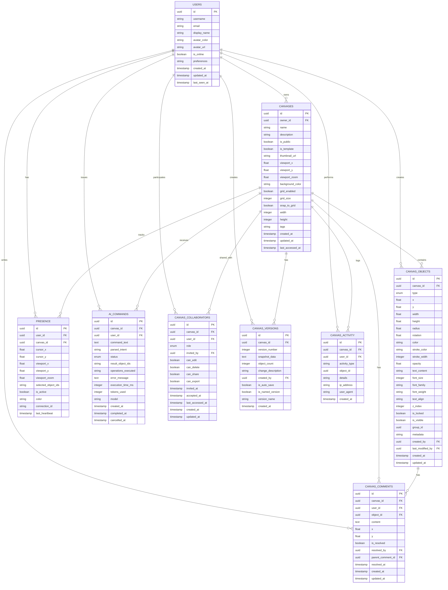

# CollabCanvas Architecture Diagram

## System Overview

This document describes the architecture and data flow between the React Native frontend and backend services for CollabCanvas, showing both HTTP REST API endpoints and WebSocket real-time connections.

---

## High-Level Architecture


---

## Detailed Component Interactions


---

## HTTP REST API Endpoints

```mermaid
graph LR
    subgraph "Authentication APIs"
        A1[POST /api/gauntlet/auth/login]
        A2[POST /api/gauntlet/auth/register]
        A3[POST /api/gauntlet/auth/refresh]
        A4[DELETE /api/gauntlet/auth/logout]
        A5[GET /api/gauntlet/auth/profile]
        A6[PUT /api/gauntlet/auth/profile]
    end
    
    subgraph "Canvas APIs"
        C1[GET /api/gauntlet/canvas]
        C2[POST /api/gauntlet/canvas]
        C3[GET /api/gauntlet/canvas/{id}]
        C4[PUT /api/gauntlet/canvas/{id}]
        C5[DELETE /api/gauntlet/canvas/{id}]
        C6[POST /api/gauntlet/canvas/{id}/fork]
        C7[GET /api/gauntlet/canvas/{id}/history]
    end
    
    subgraph "Shape APIs - Read Only"
        S1[GET /api/gauntlet/canvas/{id}/shapes]
        S2[GET /api/gauntlet/canvas/{id}/shapes/{shapeId}]
    end
    
    subgraph "AI APIs - Read Only"
        AI1[GET /api/gauntlet/ai/history]
        AI2[GET /api/gauntlet/ai/suggestions]
    end
    
    subgraph "Collaboration APIs"
        CO1[GET /api/gauntlet/canvas/{id}/collaborators]
        CO2[POST /api/gauntlet/canvas/{id}/invite]
        CO3[DELETE /api/gauntlet/canvas/{id}/collaborators/{userId}]
        CO4[PUT /api/gauntlet/canvas/{id}/permissions]
    end
    
    subgraph "WebSocket Real-time Operations"
        WS1[Shape Create/Update/Delete]
        WS2[AI Command Processing]
        WS3[Cursor & Presence]
        WS4[Canvas Sync]
    end
```

---

## WebSocket Event Flow


---

## Redux State Flow


---

## Database Schema (Entity Relationship Diagram)



---

## Database Tables Detailed Specifications

### Core Tables

#### `users` Table
Stores user account information for canvas collaboration.

| Field | Type | Constraints | Description |
|-------|------|-------------|-------------|
| id | UUID | PK | Primary key |
| username | VARCHAR(50) | UNIQUE, NOT NULL | Unique username |
| email | VARCHAR(255) | UNIQUE, NOT NULL | User email address |
| display_name | VARCHAR(100) | | Display name for UI |
| avatar_color | VARCHAR(7) | NOT NULL | Hex color for cursor (#RRGGBB) |
| avatar_url | TEXT | | URL to user avatar image |
| is_online | BOOLEAN | DEFAULT false | Current online status |
| preferences | JSONB | | User preferences as JSON |
| created_at | TIMESTAMP | NOT NULL | Account creation time |
| updated_at | TIMESTAMP | NOT NULL | Last update time |
| last_seen_at | TIMESTAMP | | Last activity timestamp |

**Indexes:** 
- `idx_users_email` on (email)
- `idx_users_username` on (username)
- `idx_users_is_online` on (is_online)

---

#### `canvases` Table
Stores canvas metadata and settings.

| Field | Type | Constraints | Description |
|-------|------|-------------|-------------|
| id | UUID | PK | Primary key |
| owner_id | UUID | FK → users.id | Canvas owner |
| name | VARCHAR(255) | NOT NULL | Canvas name |
| description | TEXT | | Canvas description |
| is_public | BOOLEAN | DEFAULT false | Public access control |
| is_template | BOOLEAN | DEFAULT false | Template flag |
| thumbnail_url | TEXT | | Canvas preview image |
| viewport_x | FLOAT | DEFAULT 0 | Default view X position |
| viewport_y | FLOAT | DEFAULT 0 | Default view Y position |
| viewport_zoom | FLOAT | DEFAULT 1.0 | Default zoom level |
| background_color | VARCHAR(7) | DEFAULT '#FFFFFF' | Background hex color |
| grid_enabled | BOOLEAN | DEFAULT false | Show grid |
| grid_size | INTEGER | DEFAULT 20 | Grid cell size |
| snap_to_grid | BOOLEAN | DEFAULT false | Snap objects to grid |
| width | INTEGER | | Canvas width |
| height | INTEGER | | Canvas height |
| tags | JSONB | | Array of tags |
| created_at | TIMESTAMP | NOT NULL | Creation time |
| updated_at | TIMESTAMP | NOT NULL | Last update time |
| last_accessed_at | TIMESTAMP | | Last access time |

**Indexes:**
- `idx_canvases_owner_id` on (owner_id)
- `idx_canvases_updated_at` on (updated_at DESC)
- `idx_canvases_is_public` on (is_public)
- `idx_canvases_owner_updated` on (owner_id, updated_at DESC)

---

#### `canvas_objects` Table
Stores individual shapes and elements on the canvas.

| Field | Type | Constraints | Description |
|-------|------|-------------|-------------|
| id | UUID | PK | Primary key |
| canvas_id | UUID | FK → canvases.id | Parent canvas |
| type | ENUM | NOT NULL | 'rectangle', 'circle', 'text', 'line', 'polygon', 'image' |
| x | FLOAT | NOT NULL | X position |
| y | FLOAT | NOT NULL | Y position |
| width | FLOAT | | Width (null for circles) |
| height | FLOAT | | Height (null for circles) |
| radius | FLOAT | | Radius (for circles) |
| rotation | FLOAT | DEFAULT 0 | Rotation in degrees |
| color | VARCHAR(9) | NOT NULL | Fill color with alpha |
| stroke_color | VARCHAR(9) | | Stroke color |
| stroke_width | INTEGER | DEFAULT 0 | Stroke width in pixels |
| opacity | FLOAT | DEFAULT 1.0 | Opacity 0-1 |
| text_content | TEXT | | Text content (for text type) |
| font_size | INTEGER | | Font size (for text type) |
| font_family | VARCHAR(100) | | Font family |
| font_weight | VARCHAR(20) | | Font weight |
| text_align | VARCHAR(20) | | Text alignment |
| z_index | INTEGER | NOT NULL | Layer order |
| is_locked | BOOLEAN | DEFAULT false | Lock editing |
| is_visible | BOOLEAN | DEFAULT true | Visibility flag |
| group_id | UUID | | Grouping identifier |
| metadata | JSONB | | Additional properties |
| created_by | UUID | FK → users.id | Creator user |
| last_modified_by | UUID | FK → users.id | Last modifier |
| created_at | TIMESTAMP | NOT NULL | Creation time |
| updated_at | TIMESTAMP | NOT NULL | Last update time |

**Indexes:**
- `idx_canvas_objects_canvas_id` on (canvas_id)
- `idx_canvas_objects_z_index` on (canvas_id, z_index)
- `idx_canvas_objects_created_by` on (created_by)
- `idx_canvas_objects_group_id` on (group_id) WHERE group_id IS NOT NULL

---

#### `presence` Table ⚡ Ephemeral
Tracks real-time user presence and cursor positions. **Auto-delete after 30s of inactivity.**

| Field | Type | Constraints | Description |
|-------|------|-------------|-------------|
| id | UUID | PK | Primary key |
| user_id | UUID | FK → users.id | User |
| canvas_id | UUID | FK → canvases.id | Canvas |
| cursor_x | FLOAT | NOT NULL | Cursor X position |
| cursor_y | FLOAT | NOT NULL | Cursor Y position |
| viewport_x | FLOAT | | Current viewport X |
| viewport_y | FLOAT | | Current viewport Y |
| viewport_zoom | FLOAT | | Current zoom level |
| selected_object_ids | JSONB | | Array of selected IDs |
| is_active | BOOLEAN | DEFAULT true | Active status |
| color | VARCHAR(7) | | Cursor color override |
| connection_id | VARCHAR(100) | | WebSocket connection ID |
| last_heartbeat | TIMESTAMP | NOT NULL | Last heartbeat (TTL 30s) |

**Indexes:**
- `idx_presence_canvas_id` on (canvas_id)
- `idx_presence_user_canvas` on (user_id, canvas_id)
- `idx_presence_heartbeat` on (last_heartbeat) for TTL cleanup

**TTL Policy:** DELETE WHERE last_heartbeat < NOW() - INTERVAL '30 seconds'

---

#### `ai_commands` Table
Stores AI command history and execution results.

| Field | Type | Constraints | Description |
|-------|------|-------------|-------------|
| id | UUID | PK | Primary key |
| canvas_id | UUID | FK → canvases.id | Target canvas |
| user_id | UUID | FK → users.id | Requesting user |
| command_text | TEXT | NOT NULL | Original command |
| parsed_intent | TEXT | | AI-interpreted intent |
| status | ENUM | NOT NULL | 'pending', 'executing', 'completed', 'failed', 'cancelled' |
| result_object_ids | JSONB | | Array of created/modified IDs |
| operations_executed | JSONB | | Array of operations |
| error_message | TEXT | | Error message if failed |
| execution_time_ms | INTEGER | | Execution time |
| tokens_used | INTEGER | | AI tokens consumed |
| model | VARCHAR(50) | | AI model used |
| created_at | TIMESTAMP | NOT NULL | Command time |
| completed_at | TIMESTAMP | | Completion time |
| cancelled_at | TIMESTAMP | | Cancellation time |

**Indexes:**
- `idx_ai_commands_canvas_id` on (canvas_id)
- `idx_ai_commands_user_id` on (user_id)
- `idx_ai_commands_created_at` on (created_at DESC)
- `idx_ai_commands_status` on (status)

---

### Supporting Tables

#### `canvas_versions` Table
Stores canvas snapshots for history/recovery.

| Field | Type | Constraints | Description |
|-------|------|-------------|-------------|
| id | UUID | PK | Primary key |
| canvas_id | UUID | FK → canvases.id | Parent canvas |
| version_number | INTEGER | NOT NULL | Incremental version |
| snapshot_data | JSONB | NOT NULL | Full canvas state |
| object_count | INTEGER | | Number of objects |
| change_description | TEXT | | Description of changes |
| created_by | UUID | FK → users.id | Creator |
| is_auto_save | BOOLEAN | DEFAULT true | Auto vs manual save |
| is_named_version | BOOLEAN | DEFAULT false | User-named version |
| version_name | VARCHAR(100) | | Version name |
| created_at | TIMESTAMP | NOT NULL | Creation time |

**Indexes:**
- `idx_canvas_versions_canvas_id` on (canvas_id, created_at DESC)
- `idx_canvas_versions_version` on (canvas_id, version_number)

---

#### `canvas_collaborators` Table
Manages canvas sharing and permissions.

| Field | Type | Constraints | Description |
|-------|------|-------------|-------------|
| id | UUID | PK | Primary key |
| canvas_id | UUID | FK → canvases.id | Shared canvas |
| user_id | UUID | FK → users.id | Collaborator |
| role | ENUM | NOT NULL | 'owner', 'editor', 'viewer' |
| invited_by | UUID | FK → users.id | Inviter |
| can_edit | BOOLEAN | DEFAULT false | Edit permission |
| can_delete | BOOLEAN | DEFAULT false | Delete permission |
| can_share | BOOLEAN | DEFAULT false | Share permission |
| can_export | BOOLEAN | DEFAULT false | Export permission |
| invited_at | TIMESTAMP | | Invitation time |
| accepted_at | TIMESTAMP | | Acceptance time |
| last_accessed_at | TIMESTAMP | | Last access time |
| created_at | TIMESTAMP | NOT NULL | Creation time |
| updated_at | TIMESTAMP | NOT NULL | Update time |

**Indexes:**
- `idx_canvas_collaborators_canvas` on (canvas_id)
- `idx_canvas_collaborators_user` on (user_id)
- `idx_canvas_collaborators_unique` on (canvas_id, user_id) UNIQUE

---

#### `canvas_comments` Table (Optional)
Allows users to comment on canvas areas or objects.

| Field | Type | Constraints | Description |
|-------|------|-------------|-------------|
| id | UUID | PK | Primary key |
| canvas_id | UUID | FK → canvases.id | Parent canvas |
| user_id | UUID | FK → users.id | Comment author |
| object_id | UUID | FK → canvas_objects.id | Related object |
| content | TEXT | NOT NULL | Comment content |
| x | FLOAT | | X position if not tied to object |
| y | FLOAT | | Y position |
| is_resolved | BOOLEAN | DEFAULT false | Resolution status |
| resolved_by | UUID | FK → users.id | Resolver |
| resolved_at | TIMESTAMP | | Resolution time |
| parent_comment_id | UUID | FK → canvas_comments.id | Parent for threads |
| created_at | TIMESTAMP | NOT NULL | Creation time |
| updated_at | TIMESTAMP | NOT NULL | Update time |

**Indexes:**
- `idx_canvas_comments_canvas` on (canvas_id)
- `idx_canvas_comments_object` on (object_id) WHERE object_id IS NOT NULL
- `idx_canvas_comments_user` on (user_id)

---

#### `canvas_activity` Table
Tracks all canvas activities for audit trail.

| Field | Type | Constraints | Description |
|-------|------|-------------|-------------|
| id | UUID | PK | Primary key |
| canvas_id | UUID | FK → canvases.id | Related canvas |
| user_id | UUID | FK → users.id | Actor |
| activity_type | VARCHAR(50) | NOT NULL | Activity type |
| object_id | UUID | | Related object ID |
| details | JSONB | | Activity details |
| ip_address | VARCHAR(45) | | User IP address |
| user_agent | TEXT | | User agent string |
| created_at | TIMESTAMP | NOT NULL | Activity time |

**Indexes:**
- `idx_canvas_activity_canvas` on (canvas_id, created_at DESC)
- `idx_canvas_activity_user` on (user_id, created_at DESC)
- `idx_canvas_activity_type` on (activity_type)

**Activity Types:**
- `object_created`, `object_updated`, `object_deleted`
- `canvas_shared`, `canvas_forked`, `canvas_exported`
- `collaborator_added`, `collaborator_removed`, `permissions_changed`
- `version_created`, `version_restored`
- `ai_command_executed`

---

## API Endpoint Specifications

### Authentication Endpoints

| Method | Endpoint | Purpose | Request Body | Response |
|--------|----------|---------|--------------|----------|
| POST | `/api/gauntlet/auth/login` | User login | `{email, password}` | `{token, user, expires}` |
| POST | `/api/gauntlet/auth/register` | User registration | `{email, password, name}` | `{token, user, expires}` |
| POST | `/api/gauntlet/auth/refresh` | Refresh auth token | `{refreshToken}` | `{token, expires}` |
| DELETE | `/api/gauntlet/auth/logout` | User logout | `{}` | `{success: true}` |
| GET | `/api/gauntlet/auth/profile` | Get user profile | - | `{user}` |
| PUT | `/api/gauntlet/auth/profile` | Update profile | `{name, avatar}` | `{user}` |

### Canvas Management Endpoints

| Method | Endpoint | Purpose | Request Body | Response |
|--------|----------|---------|--------------|----------|
| GET | `/api/gauntlet/canvas` | List user canvases | - | `{canvases[]}` |
| POST | `/api/gauntlet/canvas` | Create new canvas | `{name, description, isPublic}` | `{canvas}` |
| GET | `/api/gauntlet/canvas/{id}` | Get canvas details | - | `{canvas, shapes[], collaborators[]}` |
| PUT | `/api/gauntlet/canvas/{id}` | Update canvas metadata | `{name, description, isPublic}` | `{canvas}` |
| DELETE | `/api/gauntlet/canvas/{id}` | Delete canvas | - | `{success: true}` |
| POST | `/api/gauntlet/canvas/{id}/fork` | Fork canvas | `{name}` | `{canvas}` |
| GET | `/api/gauntlet/canvas/{id}/history` | Get canvas history | - | `{history[]}` |

### Shape Operations Endpoints

**Note:** Shape create/update/delete operations are performed via **WebSocket** for real-time synchronization. HTTP endpoints are read-only for initial load and bulk retrieval.

| Method | Endpoint | Purpose | Request Body | Response |
|--------|----------|---------|--------------|----------|
| GET | `/api/gauntlet/canvas/{id}/shapes` | Get all shapes | - | `{shapes[]}` |
| GET | `/api/gauntlet/canvas/{id}/shapes/{shapeId}` | Get single shape | - | `{shape}` |

**Real-time Operations (WebSocket):**
- `OBJECT_CREATED` - Create new shape
- `OBJECT_UPDATED` - Update existing shape
- `OBJECT_DELETED` - Delete shape
- `OBJECTS_BATCH` - Batch operations

### AI Integration Endpoints

**Note:** AI command processing is performed via **WebSocket** for real-time synchronization across all users. HTTP endpoints are read-only for history and suggestions.

| Method | Endpoint | Purpose | Request Body | Response |
|--------|----------|---------|--------------|----------|
| GET | `/api/gauntlet/ai/suggestions` | Get AI suggestions | `?canvasId={id}` | `{suggestions[]}` |
| GET | `/api/gauntlet/ai/history` | Get AI command history | `?canvasId={id}` | `{history[]}` |

**Real-time AI Operations (WebSocket):**
- `AI_COMMAND_START` - Initiate AI command processing
- `AI_COMMAND_PROGRESS` - Progress updates during execution
- `AI_COMMAND_COMPLETE` - Command completed successfully
- `AI_COMMAND_ERROR` - Command failed with error

---

## WebSocket Message Types

### Connection Management
```json
{
  "type": "CONNECTION_ESTABLISHED",
  "userId": "string",
  "canvasId": "string",
  "timestamp": "number"
}
```

### Real-time Canvas Operations
```json
{
  "type": "SHAPE_CREATE" | "SHAPE_UPDATE" | "SHAPE_DELETE",
  "userId": "string",
  "canvasId": "string",
  "data": {
    "shapeId": "string",
    "shape": "ShapeObject",
    "operation": "string"
  },
  "timestamp": "number"
}
```

### Cursor and Presence
```json
{
  "type": "CURSOR_MOVE" | "USER_JOIN" | "USER_LEAVE",
  "userId": "string",
  "canvasId": "string",
  "data": {
    "x": "number",
    "y": "number",
    "user": "UserObject"
  },
  "timestamp": "number"
}
```

### AI Operations
```json
{
  "type": "AI_COMMAND_START" | "AI_COMMAND_PROGRESS" | "AI_COMMAND_COMPLETE" | "AI_COMMAND_ERROR" | "AI_COMMAND_CANCEL",
  "userId": "string",
  "canvasId": "string",
  "data": {
    "commandId": "string",
    "command": "string",
    "operations": "CanvasOperation[]",
    "response": "string",
    "error": "string",
    "progress": "number (0-100)",
    "reason": "string (for cancellation)"
  },
  "timestamp": "number"
}
```

---

## Error Handling & Status Codes

### HTTP Status Codes
- `200` - Success
- `201` - Created
- `400` - Bad Request
- `401` - Unauthorized
- `403` - Forbidden
- `404` - Not Found
- `409` - Conflict (concurrent edit)
- `429` - Rate Limited
- `500` - Internal Server Error

### WebSocket Error Messages
```json
{
  "type": "ERROR",
  "code": "UNAUTHORIZED" | "CANVAS_NOT_FOUND" | "OPERATION_FAILED",
  "message": "string",
  "timestamp": "number"
}
```

---

## Performance Considerations

### HTTP API Optimization
- Response compression (gzip/brotli)
- Pagination for large datasets
- ETags for caching
- Rate limiting per user/endpoint
- CDN for static assets

### WebSocket Optimization (Primary Data Path)
- **Message batching** for rapid operations (queue and flush every 16ms for 60fps)
- **Delta compression** for shape updates (only send changed properties)
- **Cursor throttling** (max 30fps, ~33ms intervals)
- **Presence debouncing** (batch presence updates every 100ms)
- **Connection pooling** for scalability
- **Binary protocol** for large data transfers (canvas snapshots)
- **Message prioritization** (AI commands > shape updates > cursor moves)

### Real-time Performance Targets
- **Shape Operations:** <100ms end-to-end latency
- **Cursor Updates:** <50ms latency (30fps throttled)
- **AI Commands:** <2s for single-step operations
- **Canvas Sync:** <500ms for initial load
- **Concurrent Users:** Support 10+ per canvas without degradation

### Caching Strategy
- Canvas metadata: 5 minutes (HTTP)
- User profiles: 30 minutes (HTTP)
- AI suggestions: 1 hour (HTTP)
- Canvas state: Real-time via WebSocket (no HTTP cache)
- Static assets: 1 day (CDN)

---

*This architecture supports real-time collaboration with high performance, scalable AI integration, and robust error handling for the CollabCanvas application.*
